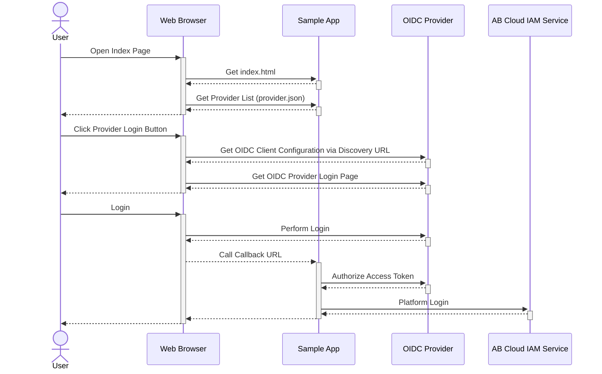

# AccelByte Cloud and 3rd Party OpenID Connect Login Integration Using AccelByte C# (.NET) Server SDK

## Overview

AccelByte Cloud provides [integration with OpenID Connect providers](https://docs.accelbyte.io/guides/access/3rd-party-platform-integration.html#openid-connect) as one of the 3rd party login integration options. Any OpenID Connect providers should work. The following sample app will show you how to do this with AccelByte C# Server SDK and [PhantAuth](https://www.phantauth.net/) (an OpenID Connect provider to simplify testing).

## Sample App

1. Clone [AccelByte C# Server SDK](https://github.com/AccelByte/accelbyte-csharp-sdk) 
2. Go to [samples/AccelByte.Sdk.Sample.OIDC.Web](https://github.com/AccelByte/accelbyte-csharp-sdk/tree/main/samples/AccelByte.Sdk.Sample.OIDC.Web) folder
3. Follow the [README.md](https://github.com/AccelByte/accelbyte-csharp-sdk/tree/main/samples/AccelByte.Sdk.Sample.OIDC.Web#readme) to setup and use the sample application

## How It Works



## Code Walktrough

### 1. How to get provider’s OpenID configuration and execute a sign-in request

In `index.html`:

This function is to get config from discovery url and after the config is retrieved, it creates an `OidcClient` object. Note that the `response_type` is code, as we want to get the access code to be authorized later.

```javascript
function discoverOidConfigAndCreateClient(config, onCreated) {
    $.ajax({
        url: config.discovery_url,
        method: 'GET',
        success: function (dResp) {
            var oidcClient = new Oidc.OidcClient({
                authority: dResp.issuer,
                client_id: config.client_id,
                redirect_uri: (window.location.href + 'callback?provider=' + config.key),
                response_type: "code",
                scope: config.scope,
                filterProtocolClaims: false,
                loadUserInfo: false
            });
            if (onCreated != undefined)
                onCreated(oidcClient, dResp);
        }
    });
}
```

And this code shows the usage of the above function and uses the `OidcClient` object to make a sign-in request and redirect the web page to the provider's login page.

```javascript
discoverOidConfigAndCreateClient(config, function (client, discData) {
        client.createSigninRequest({
            state: {
                bar: Math.random()
            }
        }).then(function (req) {
            window.location = req.url;
        }).catch(function (err) {
            console.log(err);
            window.alert(err);
        });
    });
```
### 2. How to receive callback from provider and authorize the access token

Processing access token received from the provider is done on the backend side. These codes shows how to receive then using plain .NET web server (kestrel)

```cs
public async Task Invoke(HttpContext context)
{
    string route = (context.Request.Method.ToUpper() + " " + context.Request.Path);
    if (route == "GET /callback")
    {
        string providerId = String.Empty;
        string authCode = String.Empty;

        if (context.Request.Query.ContainsKey("provider"))
            providerId = context.Request.Query["provider"].ToString().Trim().ToLower();
        if (context.Request.Query.ContainsKey("code"))
            authCode = context.Request.Query["code"].ToString().Trim();

        var dProviders = _Providers.ToDictionary();
        if (!dProviders.ContainsKey(providerId))
        {
            context.Response.StatusCode = 400;
            await context.Response.WriteAsync("UNRECOGNIZED PROVIDER");
        }

        ProviderSpecification spec = dProviders[providerId];
        OAuthTokens tokens = GetAuthorizedToken(spec, authCode);

        ...
    }

    ...
}
```

The provider will send authentication or access code, and by using this code, we want to authorize it so we can use the later tokens as our platform token for AccelByte. Authorizing an auth code done using this method:

```cs
protected OAuthTokens GetAuthorizedToken(ProviderSpecification spec, string authorizationToken)
{
    HttpClient client = new HttpClient();
    DiscoveryData dData = DiscoveryData.Retrieve(client, spec.DiscoveryUrl);

    HttpRequestMessage req = new HttpRequestMessage(HttpMethod.Post, dData.TokenEndpoint);
    req.Content = new FormUrlEncodedContent(new Dictionary<string, string>()
    {
        {"grant_type", "authorization_code" },
        {"client_id", spec.ClientId },
        {"client_secret", spec.ClientSecret },
        {"redirect_uri", "http://localhost:9090/callback" },
        {"code", authorizationToken }
    });
    
    HttpResponseMessage response = client.Send(req);
    string jsonString = Helper.ConvertInputStreamToString(response.Content.ReadAsStream());

    return JsonSerializer.Deserialize<OAuthTokens>(jsonString)!;
}
```
        
It sends the auth code to the provider’s token endpoint with grant_type authorization_code. It will return a collection of authorized tokens. One of them is `id_token` which we will use later.

### 3. How to use the authorized tokens for AccelByte c# Server SDK LoginProvider method

These codes show how to use the id token to login to the AccelByte backend.

```cs
try
{
    AccelByteSDK sdk = AccelByteSDK.Builder
        .UseDefaultHttpClient()
        .UseDefaultConfigRepository()
        .UseDefaultTokenRepository()
        .UseDefaultCredentialRepository()
        .Build();

    string output = String.Empty;
    sdk.LoginPlatform(spec.ABPlatformId, tokens.ID, (otr) =>
        {
            output = JsonSerializer.Serialize(otr);                          
        });

    context.Response.StatusCode = 200;
    await context.Response.WriteAsync(output);
}
catch (Exception x)
{
    context.Response.StatusCode = 500;
    await context.Response.WriteAsync(x.Message);
}
```

This uses the `id_token` to Sdk’s `LoginPlatform` method.

## More

### Adding Other OIDC Providers to This Sample App

You just need to provide all of the required fields into JSON array in `providers.json`.

* `name` will be shown in the sample application web index page.
* `key` is the unique identifier for this provider, make sure it follows standard variable naming.
* `discovery_url` is the url provided by the provider for the configuration. Consult their respective documentation for this value.
* `client_id` is an identifier provided by the provider.
* `client_secret` , similar to `client_id`, will be provided by the provider. In some cases, there are some OIDC public instances that do not use client secret value. In that case, just leave this field blank.
* `scope` is all the scopes required by the application. For this sample app, the scopes mentioned in the sample json is enough.
* `platform_id` is the identifier you fill in the AccelByte admin panel when registering the OIDC provider.
