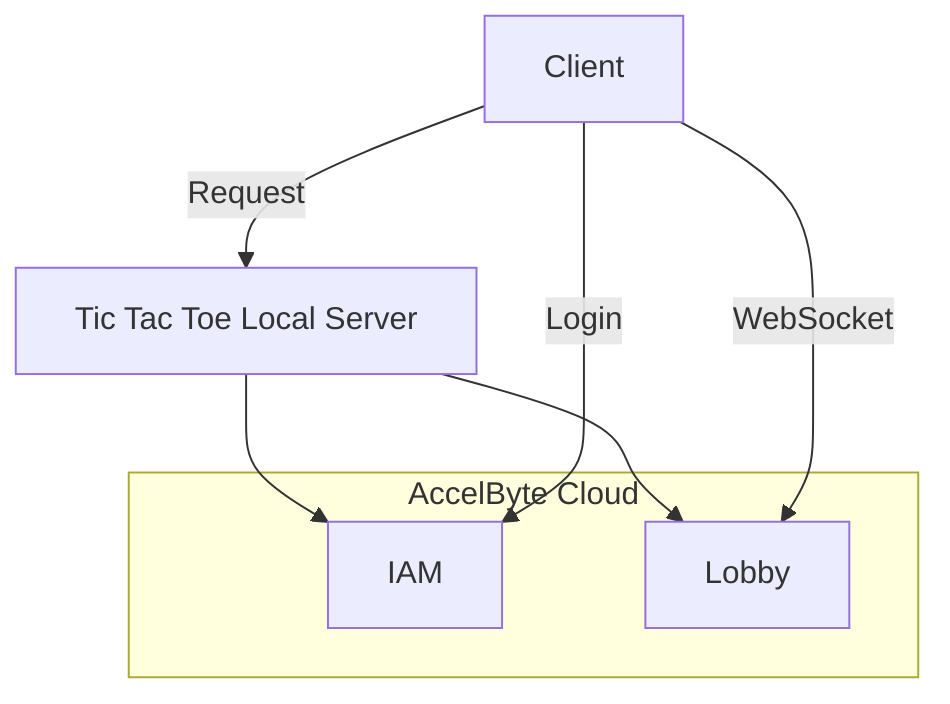
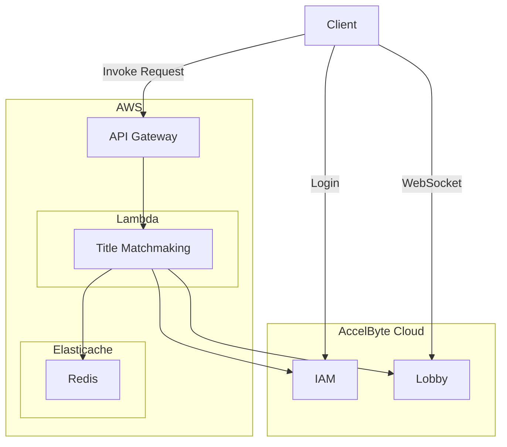
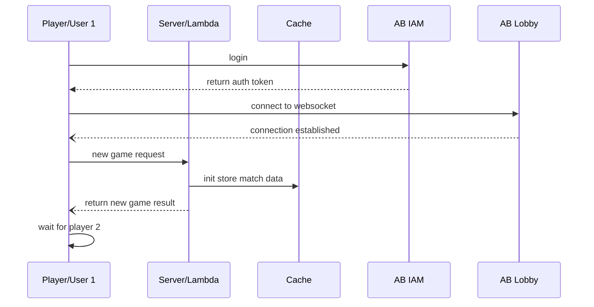
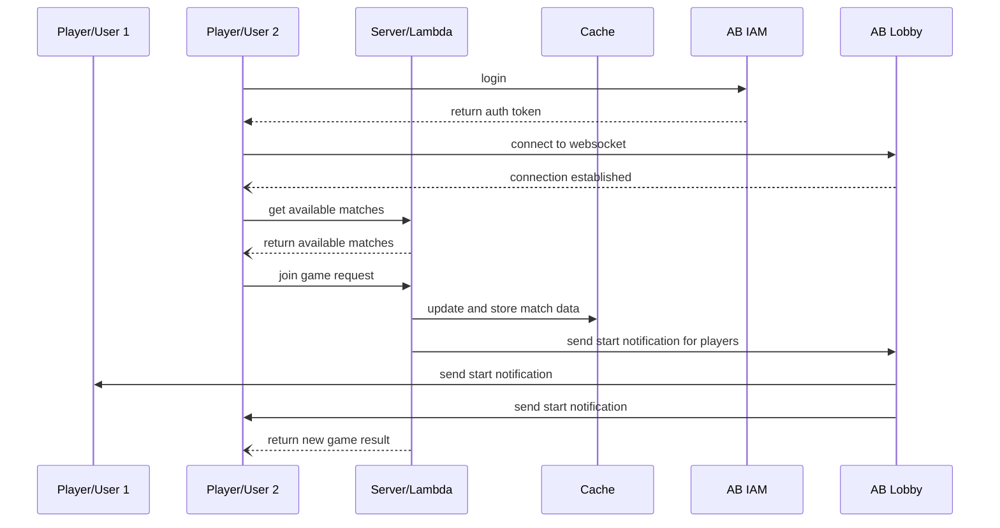
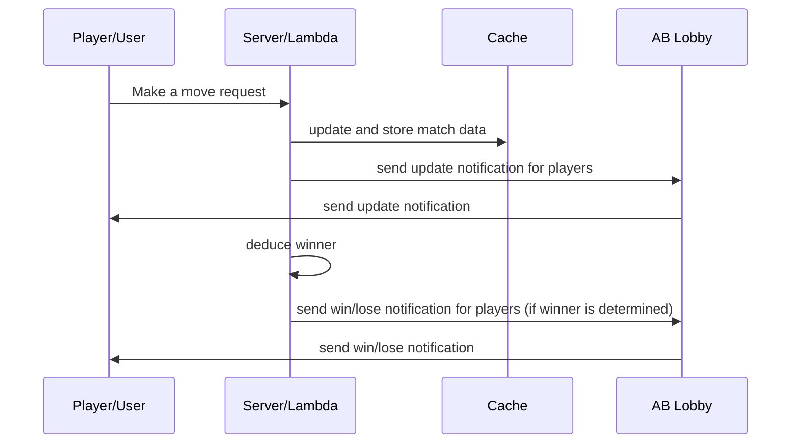

# Tic Tac Toe using AccelByte .NET (C#) Server SDK

## Overview
This tutorial will explain on how to use AccelByte .NET (C#) Server SDK to create simple Tic Tac Toe backend service and game client. This tutorial also will explain on how to configure and run the provided local server sample as well as AWS Lambda sample.

## Prerequisites
- [Create a Game Namespace](https://docs.accelbyte.io/esg/uam/namespaces.html#tutorials) if you don't have one yet. Be sure to keep the namespace's **ID** as you will need it later.
- [Create and OAuth Client](https://docs.accelbyte.io/esg/uam/iam-client.html#managing-clients-in-the-admin-portal) with a **confidential** client type. Keep the **Client ID** and the **Client Secret** somewhere safe as you will be using them in this tutorial. Make sure you add these permissions for the oauth client.
	- `NAMESPACE:<namespace>:USER:*:NOTIFICATION` CREATE, UPDATE
	- `NAMESPACE:<namespace>:USER` READ
- Download the latest [AccelByte .NET (C#) SDK](https://github.com/AccelByte/accelbyte-csharp-sdk)
- Read [.NET (C#) SDK Getting Started Guide](https://docs.accelbyte.io/guides/customization/csharp-sdk-guide.html#tutorials) on how to integrate SDK into your project.
- AWS account with enough permission to deploy Lambda function (optional).
- At least two username registered in AccelByte Cloud for testing purpose.

## How it Works (Server-Side)
### Architecture for Local Server


### Architect for AWS Lambda


#### Sequence Diagram for New Game Request


#### Sequence Diagram for Join Game Request


#### Sequence Diagram for Make a Move Request


## Using Sample Applications
### Local Server
- For local server sample application, go to `samples/AccelByte.Sdk.Sample.TicTacToe.Server` directory.
- Build the application using `dotnet build`.
- Configure environment variables for AccelByte Cloud connection or use JSON config file as mentioned in project's [README](https://github.com/AccelByte/accelbyte-csharp-sdk/tree/main/samples/AccelByte.Sdk.Sample.TicTacToe.Server/README.md).
- Run the application using `dotnet run`. Or if using JSON config file, run using `dotnet run -- --sdk-config <json file>`.

### Game Client (Local Server)
- For matchmaking client sample application, go to `samples/AccelByte.Sdk.Sample.TicTacToe.Game` directory.
- Build the application using `dotnet build`.
- Configure environment variables for AccelByte Cloud connection or use JSON config file as mentioned in project's [README](https://github.com/AccelByte/accelbyte-csharp-sdk/tree/main/samples/AccelByte.Sdk.Sample.TicTacToe.Game/README.md).
- You can choose to configure user's credentials directly using JSON file or command line options. Refer to the README on how to use it.
- Make sure you run local server sample application first.
- Run the application using `dotnet run`.

### AWS Lambda Function Locally
- AWS SAM requires published version of all assemblies. Run `dotnet publish -c Release` in solution's root directory.
- Go to `samples/AccelByte.Sdk.Sample.TicTacToe.Lambda` directory.
- Copy `serverless.template.sample` to `serverless.template` and fill all required environment variables inside the template file.
- To run locally, use `sam local start-api --template serverless.template`.
- Use `http://127.0.0.1:3000` as matchmaking server url in client sample app.

### AWS Lambda Function on AWS
- AWS SAM requires published version of all assemblies. Run `dotnet publish -c Release` in solution's root directory.
- Go to `samples/AccelByte.Sdk.Sample.TicTacToe.Lambda` directory.
- Copy `serverless.template.sample` to `serverless.template` and fill all required environment variables inside the template file.
- To deploy lambda function, use `sam deploy --guide --template serverless.template`.
- Find your API Gateway Endpoint URL in the output values displayed after deployment and use it as matchmaking server url in client sample app.

### Game Client (AWS Lambda)
- For matchmaking client sample application, go to `samples/AccelByte.Sdk.Sample.TicTacToe.Game` directory.
- Build the application using `dotnet build`.
- Configure environment variables for AccelByte Cloud connection or use JSON config file as mentioned in project's [README](https://github.com/AccelByte/accelbyte-csharp-sdk/tree/main/samples/AccelByte.Sdk.Sample.TicTacToe.Game/README.md).
- You can choose to configure user's credentials directly using JSON file or command line options. Refer to the README on how to use it.
- Make sure you deploy Title Matchmaking Lambda function first either on AWS or local.
- Run the application using `dotnet run`.

### Run Game Client as a Player 1
1. Follow above Game Client steps.
2. For example:
```bash
# with assumption that AccelByte Cloud config is available in environment variables
$ dotnet run -- --user player1 --pass player1_pass --server http://127.0.0.1:9090
```
3. You will be presented with a simple menu similar to this:
```bash
MAIN MENU
1) Login
2) Start Game
3) Join Game
x) Exit
Choose an option : [x]
```
4. Type `1` and hit `enter` to login to AccelByte Cloud.
5. After succesfully logged in, you will be back to main menu.
```bash
MAIN MENU
1) Login
2) Start Game
3) Join Game
x) Exit
Choose an option : [x]
```
6. Now, type `2` and hit `enter` to start a new match.
7. The console should change to something like this:
```bash
Waiting for other player to join...
```
Indicating that the game client now waiting for other player (player 2) to join.
8. Now, as player 1 you need to wait until player 2 joined.
9. After player 2 joined, the console screen should change to game board.
```bash
Player 1: <player_1_username>
Player 2: <player_2_username>
      +-----+-----+-----+-----+-----+
      |     |     |     |     |     |
     C|  1  |  2  |  3  |  4  |  5  |
   R  |     |     |     |     |     |
+-----+-----+-----+-----+-----+-----+
|     |     |     |     |     |     |
|  1  |     |     |     |     |     |
|     |     |     |     |     |     |
+-----+-----+-----+-----+-----+-----+
|     |     |     |     |     |     |
|  2  |     |     |     |     |     |
|     |     |     |     |     |     |
+-----+-----+-----+-----+-----+-----+
|     |     |     |     |     |     |
|  3  |     |     |     |     |     |
|     |     |     |     |     |     |
+-----+-----+-----+-----+-----+-----+
|     |     |     |     |     |     |
|  4  |     |     |     |     |     |
|     |     |     |     |     |     |
+-----+-----+-----+-----+-----+-----+
|     |     |     |     |     |     |
|  5  |     |     |     |     |     |
|     |     |     |     |     |     |
+-----+-----+-----+-----+-----+-----+

Input your move [row,col]:
```
10. You can input which cell you want to tag with your symbol. In this game, player 1 is `o` and player 2 is `x`. The format is `row,col`. For example `1,2`, refer to row 1 and column 2. After you choose the cell's coordinate, just hit `enter`.
11. Continue the game until one of the players is the winner.
12. After the game concluded, the console will change to this:
```bash
# for the winner
Player 1: <player_1_username>
Player 2: <player_2_username>

YOU ARE THE WINNER

# for the loser
Player 1: <player_1_username>
Player 2: <player_2_username>

YOU ARE LOSE!
```

### Run Game Client as a Player 2
1. Follow similar step like above until step number 5.
2. Now, type `3` and hit `enter` to join an existing match.
3. If there are any available match, the console should change to match selection menu:
```bash
[1] <random_match_id>
Select match [1 - 1]:
```
4. You can select any match you like. In this case, type `1` and hit `enter`.
5. The console should change to game board now.
```bash
Player 1: <player_1_username>
Player 2: <player_2_username>
      +-----+-----+-----+-----+-----+
      |     |     |     |     |     |
     C|  1  |  2  |  3  |  4  |  5  |
   R  |     |     |     |     |     |
+-----+-----+-----+-----+-----+-----+
|     |     |     |     |     |     |
|  1  |     |     |     |     |     |
|     |     |     |     |     |     |
+-----+-----+-----+-----+-----+-----+
|     |     |     |     |     |     |
|  2  |     |     |     |     |     |
|     |     |     |     |     |     |
+-----+-----+-----+-----+-----+-----+
|     |     |     |     |     |     |
|  3  |     |     |     |     |     |
|     |     |     |     |     |     |
+-----+-----+-----+-----+-----+-----+
|     |     |     |     |     |     |
|  4  |     |     |     |     |     |
|     |     |     |     |     |     |
+-----+-----+-----+-----+-----+-----+
|     |     |     |     |     |     |
|  5  |     |     |     |     |     |
|     |     |     |     |     |     |
+-----+-----+-----+-----+-----+-----+

Other player's Turn.
```
6. Since player 1 has the first turn. So the player 2 will get message `Other player's Turn.` instead of cell input.
7. Wait until your turn, and if the console updated, you can input your move with similar step like the step number 10 above.
8. Continue the game until one of the players is the winner.
9. After the game concluded, the console will change to this:
```bash
# for the winner
Player 1: <player_1_username>
Player 2: <player_2_username>

YOU ARE THE WINNER

# for the loser
Player 1: <player_1_username>
Player 2: <player_2_username>

YOU ARE LOSE!
```

## Code Behind

### Game Client
- Initializing Accelbyte Cloud SDK
```csharp
//Command line argument(s) parser
CommandArguments cArgs = new CommandArguments(args);

AccelByteSdkBuilder builder = AccelByteSDK.Builder
	.UseDefaultHttpClient()
	.UseDefaultTokenRepository();

//If JSON config file is provided then use JSON config repository
if (cArgs.SdkConfigFile != String.Empty)
	builder.UseJsonConfigRepository(cArgs.SdkConfigFile);
else
//if not, then use default config repository
	builder.UseDefaultConfigRepository();
//If JSON credential file is provided, then use JSON credential repository
if (cArgs.SdkCredentialFile != String.Empty)
	builder.UseJsonCredentialRepository(cArgs.SdkCredentialFile);

//If logging is enabled
if (cArgs.IsLogEnabled)
	builder.EnableLog();
```

- Login and Connecting to Lobby WS Service
```csharp
public bool Login(string userName, string password)
{
	if (!_Sdk.LoginUser(userName, password, (tr) =>
	 {
		 UserId = tr.UserId!;
	 }))
		return false;
	_AccessToken = _Sdk.Configuration.TokenRepository.Token;

	//Connect to Lobby WS
	Task connectTask = _LobbyWs.Connect(false);
	connectTask.Wait();

	Task listenTask = Task.Run(() => _LobbyWs.Listen());
	_IsLobbyWSConnected = true;

	return true;
}
```

- New Game
```csharp
public void NewGame()
{
	if (_AccessToken == String.Empty)
		throw new Exception("No valid login session. Please login first.");
	if (!_IsLobbyWSConnected)
		throw new Exception("No active Lobby WS connection.");

	NewGameResult game = SendRequest<NewGameResult>(HttpMethod.Post, "/match/start", null);
	_PlayerSymbol = game.Symbol[0];
	ActiveMatchId = game.MatchId;
}
```

- Get Available Matches
```csharp
public List<string> GetAvailableMatches()
{
	List<MatchItem> matches = SendRequest<List<MatchItem>>(HttpMethod.Get, "/matches", null);

	List<string> matchIds = new List<string>();
	foreach (MatchItem matchItem in matches)
	{
		if (!matchItem.IsFull)
			matchIds.Add(matchItem.MatchId);
	}
	return matchIds;
}
```

- Join a Game
```csharp
public void JoinGame(string matchId)
{
	if (_AccessToken == String.Empty)
		throw new Exception("No valid login session. Please login first.");
	if (!_IsLobbyWSConnected)
		throw new Exception("No active Lobby WS connection.");

	NewGameResult game = SendRequest<NewGameResult>(HttpMethod.Post, "/match/join", new Dictionary<string, string>()
	{
		{ "match_id", matchId },
	});
	_PlayerSymbol = game.Symbol[0];
	ActiveMatchId = game.MatchId;
}
```

- Make a Move
```csharp
public void MakeAMove(int row, int col)
{
	SendRequest(HttpMethod.Post, "/match/move", new Dictionary<string, string>()
	{
		{ "match_id", ActiveMatchId },
		{ "row", row.ToString() },
		{ "column", col.ToString() }
	});
}
```

### Server
Both Local server and AWS Lambda function use the same code for tic tac toe logic.

- AB Cloud IAM User Validation
```csharp
public string ValidateAuthToken(string authToken)
{
	OauthmodelTokenResponseV3? oauthToken = _Sdk.Iam.OAuth20.VerifyTokenV3Op
		.SetPreferredSecurityMethod(Operation.SECURITY_BASIC)
		.Execute(authToken);
	if (oauthToken == null)
		throw new Exception("NULL oauthToken");
	return oauthToken.UserId!;
}
```

- Getting an Username from User Id from AB Cloud IAM Service
```csharp
public string GetUsername(string userId)
{
	ModelPublicUserResponseV3? userInfo =
		_Sdk.Iam.Users.PublicGetUserByUserIdV3Op
		.Execute(_Sdk.Namespace, userId);
	if (userInfo == null)
		throw new Exception("NULL userInfo");
	return userInfo.UserName!;
}
```

- Sending Notification to User using AB Cloud Lobby Service
```csharp
public void SendNotificationToUser(string userId, string topic, object payload)
{
	ModelFreeFormNotificationRequest notifBody = new ModelFreeFormNotificationRequest()
	{
		Topic = topic,
		Message = (payload is String ? payload.ToString() : JsonSerializer.Serialize(payload))
	};

	_Sdk.Lobby.Notification.FreeFormNotificationByUserIDOp
		.Execute(notifBody, _Sdk.Namespace, userId);
}
```

- Process a New Game/Match Request
```csharp
public NewGameResult NewGame(string userId)
{
	// creating a match data
	MatchData mData = new MatchData()
	{
		MatchId = Guid.NewGuid().ToString().Replace("-", ""),
		P1UserId = userId,
		P1Name = GetUsername(userId)
	};

	// save the match into cache
	_Cache.PushItem(CACHEKEY_MATCHLIST, mData.MatchId);
	_Cache.Save(mData.MatchId, JsonSerializer.Serialize(mData));

	// returns the match information
	return new NewGameResult()
	{
		MatchId = mData.MatchId,
		Symbol = P1Symbol.ToString(),
		UserId = userId
	};
}
```

- Process a Join Game/Match Request
```csharp
public NewGameResult JoinGame(string userId,string matchId)
{
	// try to load the specified match data and validate it
	string? strMData = _Cache.Load(matchId);
	if (strMData == null)
		throw new Exception("No match session with specified id.");

	MatchData? mData = JsonSerializer.Deserialize<MatchData>(strMData);
	if (mData == null)
		throw new Exception("Cannot deserialize match data.");

	if (mData.IsFull)
		throw new Exception("Match session is full.");

	if (mData.P1UserId == userId)
		throw new Exception("Hey, you can't play with yourself.");

	// store player 2 information and save the updated match data into cache
	mData.P2UserId = userId;
	mData.P2Name = GetUsername(userId);
	mData.InitializeEmptyBoard();
	_Cache.Save(mData.MatchId, JsonSerializer.Serialize(mData));

	// send notification to both players.
	MatchUpdate mUpdate = new MatchUpdate(mData);

	mUpdate.IsPlayerTurn = true;
	SendNotificationToUser(mData.P1UserId, WSTOPIC_START, mUpdate);

	mUpdate.IsPlayerTurn = false;
	SendNotificationToUser(mData.P2UserId, WSTOPIC_START, mUpdate);
	
	// returns the match information	
	return new NewGameResult()
	{
		MatchId = mData.MatchId,
		Symbol = P2Symbol.ToString(),
		UserId = userId
	};
}
```

- Make a Move
```csharp
public void Move(string userId, string matchId, int row, int col)
{
	// try to load the specified match data and validate it
	string? strMData = _Cache.Load(matchId);
	if (strMData == null)
		throw new Exception("No match session with specified id.");

	MatchData? mData = JsonSerializer.Deserialize<MatchData>(strMData);
	if (mData == null)
		throw new Exception("Cannot deserialize match data.");

	// get board data
	Dictionary<(int, int), char>? board = mData.BoardData;
	if (board == null)
		throw new Exception("Missing board");

	// check for previous content
	char prevContent = board[(row, col)];
	if (prevContent != ' ')
		throw new Exception("Invalid move!");

	// fill the cell
	bool isPlayer1NextTurn = false;
	if (userId == mData.P1UserId)
	{
		board[(row, col)] = P1Symbol;
		isPlayer1NextTurn = false;
	}                
	else if (userId == mData.P2UserId)
	{
		board[(row, col)] = P2Symbol;
		isPlayer1NextTurn = true;
	}

	// update the match data with updated board and save it into cache
	mData.BoardData = board;
	_Cache.Save(mData.MatchId, JsonSerializer.Serialize(mData));

	// send notification of updated board to both players
	MatchUpdate mUpdate = new MatchUpdate(mData);

	mUpdate.IsPlayerTurn = isPlayer1NextTurn;
	SendNotificationToUser(mData.P1UserId, WSTOPIC_UPDATE, mUpdate);

	mUpdate.IsPlayerTurn = !isPlayer1NextTurn;
	SendNotificationToUser(mData.P2UserId, WSTOPIC_UPDATE, mUpdate);

	// Call a function to determine the winner based on board data
	// If the winner is determined, the conclude the match and send notification of match result to both players
	int win = DeduceWinner(mData.BoardData!, mData.BoardSize);
	if (win == 1)
	{
		mData.WinnerUserId = mData.P1UserId;
		mData.IsConcluded = true;
		_Cache.Save(mData.MatchId, JsonSerializer.Serialize(mData));

		MatchUpdate newUpdate = new MatchUpdate(mData);
		SendNotificationToUser(mData.P1UserId, WSTOPIC_WIN, newUpdate);
		SendNotificationToUser(mData.P2UserId, WSTOPIC_LOSE, newUpdate);
	}
	else if (win == 2)
	{
		mData.WinnerUserId = mData.P2UserId;
		mData.IsConcluded = true;
		_Cache.Save(mData.MatchId, JsonSerializer.Serialize(mData));

		MatchUpdate newUpdate = new MatchUpdate(mData);
		SendNotificationToUser(mData.P1UserId, WSTOPIC_LOSE, newUpdate);
		SendNotificationToUser(mData.P2UserId, WSTOPIC_WIN, newUpdate);
	}
}
```

- Get Active Matches
```csharp
public List<MatchItem> GetActiveMatches()
{
	List<MatchItem> matches = new List<MatchItem>();

	List<string>? strMatches = _Cache.GetItems(CACHEKEY_MATCHLIST);
	if (strMatches != null)
	{
		foreach (string matchId in strMatches)
		{
			string? strMData = _Cache.Load(matchId);
			if (strMData == null)
				continue;

			MatchData? mData = JsonSerializer.Deserialize<MatchData>(strMData);
			if (mData == null)
				throw new Exception("Cannot deserialize match data.");

			if (!mData.IsConcluded)
			{
				matches.Add(new MatchItem()
				{
					MatchId = matchId,
					IsFull = mData.IsFull
				});
			}
		}
	}

	return matches;
}
```

- Determine who is the winner
```csharp
public int DeduceWinner(Dictionary<(int, int), char> board, int size)
{
	//Set a random number as marker. Use a pair of both even and odd number.
	double a1 = 6.0;
	double a2 = 13.0;

	List<double> values = new List<double>();

	//Calculate value for all rows
	for (int row = 0; row < size; row++)
	{
		double r_val = 0.0;
		for (int col = 0; col < size; col++)
		{
			if (board[(row, col)] == P1Symbol)
				r_val += a1;
			else if (board[(row, col)] == P2Symbol)
				r_val += a2;
		}
		values.Add(r_val / (double)size);
	}

	//Calculate value for all cols
	for (int col = 0; col < size; col++)
	{
		double c_val = 0.0;
		for (int row = 0; row < size; row++)
		{
			if (board[(row, col)] == P1Symbol)
				c_val += a1;
			else if (board[(row, col)] == P2Symbol)
				c_val += a2;
		}
		values.Add(c_val / (double)size);
	}

	//Calculate value for top-left to bottom-right line
	double lx_val = 0.0;
	for (int lx = 0; lx < size; lx++)
	{
		if (board[(lx, lx)] == P1Symbol)
			lx_val += a1;
		else if (board[(lx, lx)] == P2Symbol)
			lx_val += a2;
	}
	values.Add(lx_val / (double)size);

	//Calculate value for bottom-left to top-right line
	double rx_val = 0.0;
	for (int lx = 0; lx < size; lx++)
	{
		if (board[(4 - lx, lx)] == P1Symbol)
			rx_val += a1;
		else if (board[(4 - lx, lx)] == P2Symbol)
			rx_val += a2;
	}
	values.Add(rx_val / (double)size);

	//Determine the value for the winner. If there is at least one exact a1 value, then the winner is player 1, else if there is at least one exact a2 value, then the winner is player 2.
	int p1c = 0;
	int p2c = 0;
	foreach (double val in values)
	{
		if (val == a1)
			p1c++;
		else if (val == a2)
			p2c++;
	}

	//return result, 1 for player 1, 2 for player 2, 0 for no winner yet.
	return (p1c > p2c ? 1 : (p2c > p1c ? 2 : 0));
}
```