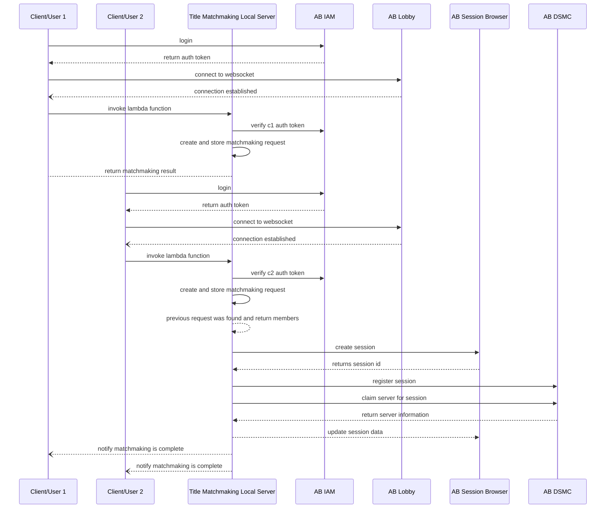
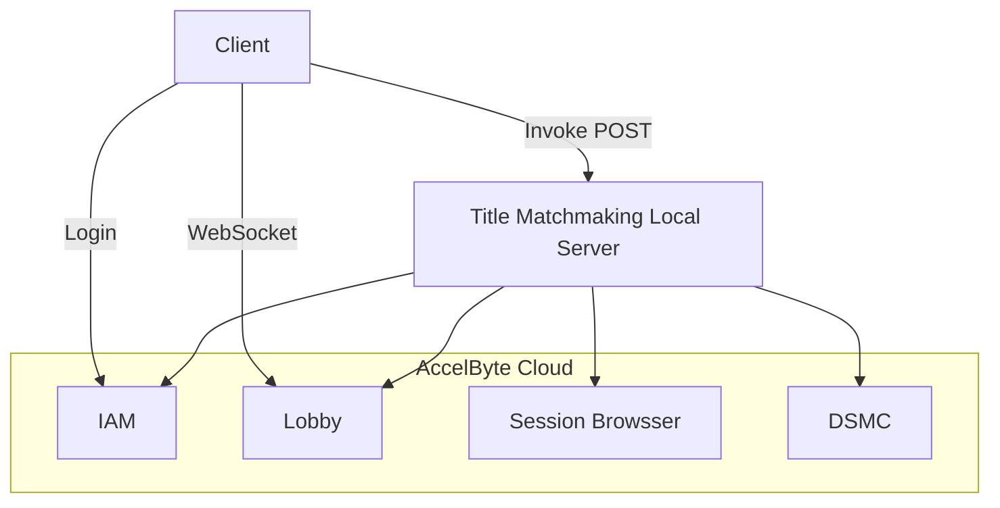
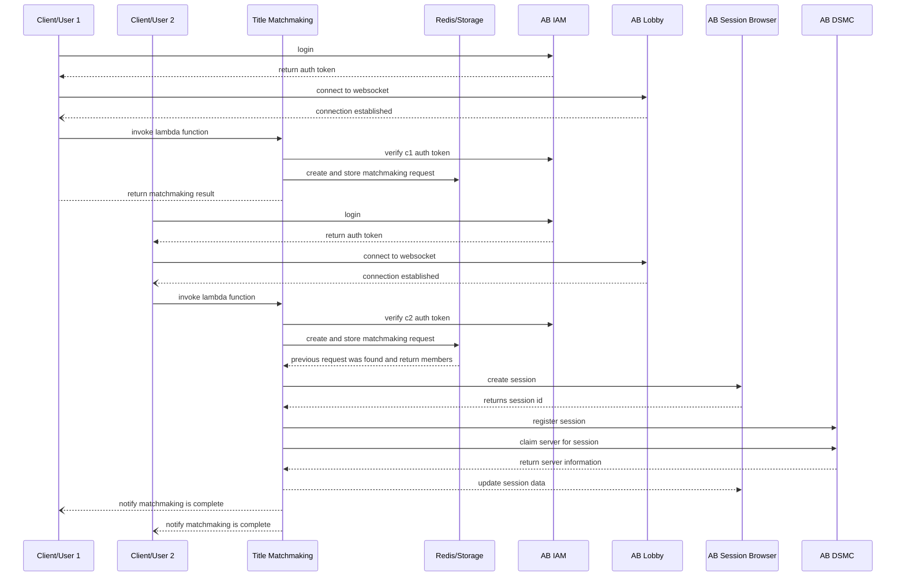
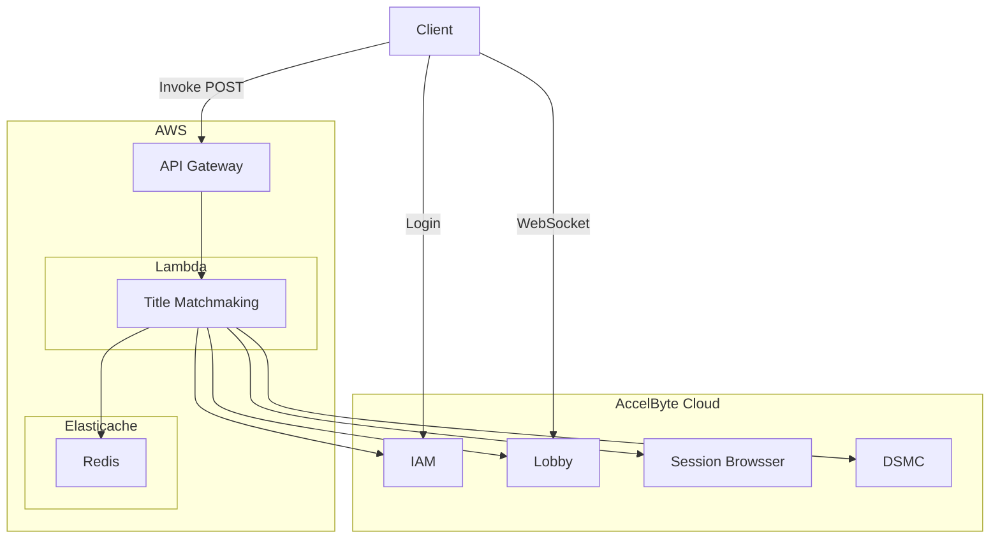

# Title Matchmaking using AccelByte .NET (C#) Server SDK

## Overview
This tutorial will explain on how to use AccelByte .NET (C#) Server SDK to create simple matchmaking backend service and client. This tutorial also will explain on how to configure and run the provided local server sample as well as AWS Lambda sample.

## Prerequisites
- [Create a Game Namespace](https://docs.accelbyte.io/esg/uam/namespaces.html#tutorials) if you don't have one yet. Be sure to keep the namespace's **ID** as you will need it later.
- [Create and OAuth Client](https://docs.accelbyte.io/esg/uam/iam-client.html#managing-clients-in-the-admin-portal) with a **confidential** client type. Keep the **Client ID** and the **Client Secret** somewhere safe as you will be using them in this tutorial. Make sure you add these permissions for the oauth client.
	- `NAMESPACE:<namespace>:SESSIONBROWSER:SESSION` CREATE, READ, UPDATE
	- `NAMESPACE:<namespace>:USER:*:NOTIFICATION` CREATE, UPDATE
	- `NAMESPACE:<namespace>:DSM:SESSION` CREATE, READ, UPDATE
	- `NAMESPACE:<namespace>:USER` READ
- Download the latest [AccelByte .NET (C#) SDK](https://github.com/AccelByte/accelbyte-csharp-sdk)
- Read [.NET (C#) SDK Getting Started Guide](https://docs.accelbyte.io/guides/customization/csharp-sdk-guide.html#tutorials) on how to integrate SDK into your project.
- AWS account with enough permission to deploy Lambda function (optional).
- At least two username registered in AccelByte Cloud for testing purpose.


## Using Sample Applications
### Local Server
- For local server sample application, go to `samples/AccelByte.Sdk.Sample.TitleMatchmaking.LocalServer` directory.
- Build the application using `dotnet build`.
- Configure environment variables for AccelByte Cloud connection or use JSON config file as mentioned in project's [README](https://github.com/AccelByte/accelbyte-csharp-sdk/tree/main/samples/AccelByte.Sdk.Sample.TitleMatchmaking.LocalServer/README.md).
- Run the application using `dotnet run`. Or if using JSON config file, run using `dotnet run --sdk-config <json file>`.

### Matchmaking Client
- For matchmaking client sample application, go to `samples/AccelByte.Sdk.Sample.TitleMatchmaking.Client` directory.
- Build the application using `dotnet build`.
- Configure environment variables for AccelByte Cloud connection or use JSON config file as mentioned in project's [README](https://github.com/AccelByte/accelbyte-csharp-sdk/tree/main/samples/AccelByte.Sdk.Sample.TitleMatchmaking.Client/README.md).
- You can choose to configure user's credentials directly using JSON file or command line options. Refer to the README on how to use it.
- Make sure you run local server sample application first.
- Run the application using `dotnet run`.


### How it Works (Local Server)


The diagram above is the Title Matchmaking logic flow. In this diagram, Title Matchmaking is using AWS Lambda and Redis as backend service.
Note that following assumption is applied:
- Max member for matchmaking is 2 users.
- Client is able to call Title Matchmaking Local Server
- Client is able to get free-form notification from lobby
- Simplified matchmaking flow, skipping consent, ppol, AccelByte Stats, event, QoS, player's attribute, and etc.


The diagram above explains the flow of how this Title Matchmaking request is received by local server

### AWS Lambda Function Locally
- AWS SAM requires published version of all assemblies. Run `dotnet publish -c Release` in solution's root directory.
- Go to `samples/AccelByte.Sdk.Sample.TitleMatchmaking.Aws` directory.
- Copy `serverless.template.sample` to `serverless.template` and fill all required environment variables inside the template file.
- To run locally, use `sam local start-api --template serverless.template`.
- Use `http://127.0.0.1:3000` as matchmaking server url in client sample app.

### AWS Lambda Function on AWS
- AWS SAM requires published version of all assemblies. Run `dotnet publish -c Release` in solution's root directory.
- Go to `samples/AccelByte.Sdk.Sample.TitleMatchmaking.Aws` directory.
- Copy `serverless.template.sample` to `serverless.template` and fill all required environment variables inside the template file.
- To deploy lambda function, use `sam deploy --guide --template serverless.template`.
- Find your API Gateway Endpoint URL in the output values displayed after deployment and use it as matchmaking server url in client sample app.

### Matchmaking Client
- For matchmaking client sample application, go to `samples/AccelByte.Sdk.Sample.TitleMatchmaking.Client` directory.
- Build the application using `dotnet build`.
- Configure environment variables for AccelByte Cloud connection or use JSON config file as mentioned in project's [README](https://github.com/AccelByte/accelbyte-csharp-sdk/tree/main/samples/AccelByte.Sdk.Sample.TitleMatchmaking.Client/README.md).
- You can choose to configure user's credentials directly using JSON file or command line options. Refer to the README on how to use it.
- Make sure you deploy Title Matchmaking Lambda function first either on AWS or local.
- Run the application using `dotnet run`.

### How It Works (AWS Lambda)

The diagram above is the Title Matchmaking logic flow. In this diagram, Title Matchmaking is using AWS Lambda and Redis as backend service.
Note that following assumption is applied:
- Max member for matchmaking is 2 users.
- Client is able to call the AWS Lambda HTTP POST
- Client is able to get free-form notification from lobby
- Simplified matchmaking flow, skipping consent, ppol, AccelByte Stats, event, QoS, player's attribute, and etc.


The diagram above explains the flow of how this Title Matchmaking is invoked by Lambda API Gateway URL with the POST method.

### Run Matchmaking Client as a Player 1
1. Follow above Matchmaking Client steps.
2. For example:
```bash
# with assumption that AccelByte Cloud config is available in environment variables
$ dotnet run --user player1 --pass player1_pass --server http://127.0.0.1:9090
```
3. You will be presented with a simple menu similar to this:
```bash
MAIN MENU
1) Login
2) Title matchmaking
x) Exit
Choose an option : [x]
```
4. Type `1` and hit `enter` to login to AccelByte Cloud.
5. After succesfully logged in, you will be shown an access token and status of Lobby WS connection.
```bash
Access Token: <access_token_string>
Lobby WS connected.
```
6. Now, Type `2` and hit `enter` to do matchmaking process.
7. The response should something like this:
```bash
# This one is message from Lobby Service
WS Message: type: messageNotif
id: <message_id>
from: system
to: <user_id>
topic: NOTIF
payload: searching
sentAt: 2022-08-25T00:45:32Z

# and this one is the response from matchmaking endpoint
Response:
{"is_first_member":true,"message":"","party_id":"","server_ip":"","server_port":0,"session_id":"","users":[]}
```
Make sure that the value of `is_first_member` must be true.

8. Now, as player 1 you need to wait until player 2 joined.

### Run Matchmaking Client as a Player 2
1. Follow similar step like above, but you will get different response.
```bash
# Response from matchmaking endpoint
Response:
{"is_first_member":false,"message":"","party_id":"<party_id>","server_ip":"","server_port":0,"session_id":"","users":["<player1_user_id>","<player2_user_id>"]}

# Notification from Lobby Service if matchmaking is completed.
WS Message: type: messageNotif
id: <message_id>
from: system
to: <user_id>
topic: NOTIF
payload: found <server>:<port>
sentAt: 2022-08-25T00:48:20Z
```
You will notice that for player 2, the value of `is_first_member` is false and this is expected. And there are additional information such as party id and members of the party.
If you use Local Server, the response should come first, and after a while, the notification arrived. This is expected as Local Server use `Task` to delegate the communication to AccelByte Cloud.
But, If you use AWS Lambda deployment, then the notification usually comes first, then after that is the response. Because in AWS Lambda function code, there is no background task involved.

## Code Behind

### Matchmaking Client
- Initializing Accelbyte Cloud SDK
```csharp
//Command line argument(s) parser
CommandArguments cArgs = new CommandArguments(args);

AccelByteSdkBuilder builder = AccelByteSDK.Builder
	.UseDefaultHttpClient()
	.UseDefaultTokenRepository();

//If JSON config file is provided then use JSON config repository
if (cArgs.SdkConfigFile != String.Empty)
	builder.UseJsonConfigRepository(cArgs.SdkConfigFile);
else
//if not, then use default config repository
	builder.UseDefaultConfigRepository();
//If JSON credential file is provided, then use JSON credential repository
if (cArgs.SdkCredentialFile != String.Empty)
	builder.UseJsonCredentialRepository(cArgs.SdkCredentialFile);

//If logging is enabled
if (cArgs.IsLogEnabled)
	builder.EnableLog();
```

- Login
```csharp
bool b = false;
//If no credential object is provided,
if (sdk.Configuration.Credential == null)
{
	string aUsername = cArgs.LoginUsername;
	if (aUsername == String.Empty)
	{
		//Ask for username
		Console.Write("Username? ");
		aUsername = Console.ReadLine()!.Trim();
	}

	string aPassword = cArgs.LoginPassword;
	if (aPassword == String.Empty)
	{
		//Ask for password
		Console.Write("Password? ");
		aPassword = Console.ReadLine()!.Trim();
	}

	//Try to login to AccelByte Cloud
	b = sdk.LoginUser(aUsername, aPassword);
}
else
	//Try to login to AccelByte Cloud using credential stored in credential repository
	b = sdk.LoginUser();

//Store access token to be used later when sending matchmaking request
_LoginAccessToken = sdk.Configuration.TokenRepository.Token;
```

- Connecting to Lobby WS Service
```csharp
//Connect to Lobby WS
Task connectTask = lobbyWs.Connect(false);
connectTask.Wait();

//After connected, listen to incoming message from Lobby WS
Task listenTask = Task.Run(() => lobbyWs.Listen());
isLobbyWSConnected = true;
Console.WriteLine("Lobby WS connected.");
```

- Request matchmaking
```csharp
//Prepare request to matchmaking server using login access token
string url = cArgs.MatchmakingServerURL + "/";
HttpRequestMessage req = new HttpRequestMessage(HttpMethod.Post, url);
req.Headers.TryAddWithoutValidation("Authorization", "Bearer " + _LoginAccessToken);

//Send the request
HttpResponseMessage resp = DefaultHttpClient.Http.Send(req);
Stream respStream = resp.Content.ReadAsStream();
string response = Helper.ConvertInputStreamToString(respStream);

//Show the response
Console.WriteLine("Response:\n{0}", response);
```

### Matchmaking Server
Both Local server and AWS Lambda function use the same code to do the matchmaking process.

- IAM User Validation
```csharp
//Validate Access Token sent from client
OauthmodelTokenResponseV3? oauthToken = _Sdk.Iam.OAuth20.VerifyTokenV3Op
	.SetPreferredSecurityMethod(Operation.SECURITY_BASIC)
	.Execute(authToken);
if (oauthToken == null)
	throw new Exception("NULL oauthToken");
//If valid, then get user id
string cUserId = oauthToken.UserId!;
```

- Create Matchmaking Request Data
```csharp
//Create matchmaking request
List<PartyData> partyData = new List<PartyData>()
{
	new PartyData()
	{
		Channel = channel.Slug,
		PartyId = Guid.NewGuid().ToString().Replace("-", ""),
		PartyMembers = new List<ModelsPartyMember>()
		{
			new ModelsPartyMember()
			{
				UserId = cUserId
			}
		},
		UserId = cUserId
	}
};
```

- Store Matchmaking Request Data
```csharp
//Save channel slug to cache
_Cache.Save(ChannelListKey, ChannelSlug);

//Check for existing matchmaking request. Mark if it does exists.
bool isMatchmakingRequestExists = _Cache.IsExists(MatchmakingRequestKey);

//Save matchmaking party data to cache
string jPartyList = JsonSerializer.Serialize(partyData);
_Cache.PushItem(MatchmakingRequestKey, jPartyList);
```

- Wait for Other User
```csharp
protected List<PartyData>? WaitAndGetOtherPartyMembers(string cUserId, bool waitUntilMaxDuration = false)
{
	int elapsedTime = 0;
	List<PartyData> otherMembers = new List<PartyData>();

	while (elapsedTime < WaitMaxDuration)
	{
		List<PartyData> partyMembers = GetPartyMembers();

		otherMembers.Clear();
		foreach (PartyData member in partyMembers)
		{
			if (member.UserId != cUserId)
				otherMembers.Add(member);
		}

		if (otherMembers.Count > 0)
		{
			if (!waitUntilMaxDuration)
				return otherMembers;
		}

		Thread.Sleep(UserCheckInterval);
		elapsedTime += UserCheckInterval;
	}

	if (otherMembers.Count > 0)
		return otherMembers;

	return null;
}

//Wait for another user.
List<PartyData>? otherMembers = WaitAndGetOtherPartyMembers(cUserId, false);
if (otherMembers == null)
	throw new Exception("Timed out! Not enough players.");

//If other user(s) are exists, then return with party members
string partyId = otherMembers[0].PartyId;

List<string> pmUserIds = new List<string>();
pmUserIds.Add(cUserId);
foreach (var party in otherMembers)
	pmUserIds.Add(party.UserId);

//Return MatchmakingResult object
return new MatchmakingResult()
{
	IsFirstMember = false,
	PartyId = partyId,
	Users = pmUserIds
};
```

- Create Session on AccelByte Cloud
```csharp
//Get MatchmakingResult object from previous step (if have enough party members)

//Get username from the first member from MatchmakingResult object
ModelPublicUserResponseV3? userInfo =
	_Sdk.Iam.Users.PublicGetUserByUserIdV3Op
	.Execute(_Sdk.Namespace, mResult.Users[0]);
if (userInfo == null)
	throw new Exception("NULL userInfo");
string _UsernameForSB = userInfo.UserName!;

//Create session
Api.Sessionbrowser.Model.ModelsCreateSessionRequest createSessionBody = new Api.Sessionbrowser.Model.ModelsCreateSessionRequest()
{
	SessionType = SessionType,
	GameVersion = GameVersion,
	Namespace = _Sdk.Namespace,
	Username = _UsernameForSB,
	GameSessionSetting = new Api.Sessionbrowser.Model.ModelsGameSessionSetting()
	{
		AllowJoinInProgress = true,
		CurrentInternalPlayer = 0,
		CurrentPlayer = 0,
		MapName = MapName,
		MaxInternalPlayer = 2,
		MaxPlayer = 0,
		Mode = SessionMode,
		NumBot = 0,
		Password = SessionPassword
	}
};

Api.Sessionbrowser.Model.ModelsSessionResponse? crSession =
	_Sdk.Sessionbrowser.Session.CreateSessionOp
		.Execute(createSessionBody, _Sdk.Namespace);
if (crSession == null)
	throw new Exception("Could not create session in AB Cloud.");
```

- Register Session and Claim Server
```csharp
//Register session on DSMC
List<Api.Dsmc.Model.ModelsRequestMatchMember> srPartyMembers = new List<Api.Dsmc.Model.ModelsRequestMatchMember>();
foreach (string pmUserId in mResult.Users)
	srPartyMembers.Add(new Api.Dsmc.Model.ModelsRequestMatchMember()
	{
		UserId = pmUserId,
	});

Api.Dsmc.Model.ModelsCreateSessionRequest sessionRequest = new Api.Dsmc.Model.ModelsCreateSessionRequest()
{
	ClientVersion = ClientVersion,
	Configuration = "",
	Deployment = TargetDeployment,
	GameMode = _GameMode,
	MatchingAllies = new List<Api.Dsmc.Model.ModelsRequestMatchingAlly>()
	{
		new Api.Dsmc.Model.ModelsRequestMatchingAlly()
		{
			MatchingParties = new List<Api.Dsmc.Model.ModelsRequestMatchParty>()
			{
				new Api.Dsmc.Model.ModelsRequestMatchParty()
				{
					PartyAttributes = new Dictionary<string, object>(),
					PartyId = mResult.PartyId,
					PartyMembers = srPartyMembers
				}
			}
		}
	},
	Region = "",
	PodName = "",
	SessionId = crSession.SessionId,
	Namespace = _Sdk.Namespace,
};

Api.Dsmc.Model.ModelsSessionResponse? regSession =
	_Sdk.Dsmc.Session.CreateSessionOp
		.Execute(sessionRequest, _Sdk.Namespace);
if (regSession == null)
	throw new Exception("Could not register session in DSMC.");

//Wait for DSMC to register the session
Thread.Sleep(5000);

//Claim server
Api.Dsmc.Model.ModelsClaimSessionRequest? claimRequest = new Api.Dsmc.Model.ModelsClaimSessionRequest()
{
	SessionId = crSession.SessionId
};
_Sdk.Dsmc.Session.ClaimServerOp.Execute(claimRequest, _Sdk.Namespace);

//Get dedicated server info from DSMC
Api.Dsmc.Model.ModelsSessionResponse? claimedSession =
	_Sdk.Dsmc.Session.GetSessionOp
	.Execute(_Sdk.Namespace, crSession.SessionId!);
if (claimedSession == null)
	throw new Exception("Claimed session does not exists.");

Api.Dsmc.Model.ModelsServer server = claimedSession.Session!.Server!;
string serverIp = server.Ip!;
int serverPort = server.Port!.Value;
```

- Update Session Data
```csharp
//Add players to server in Session Browser
foreach (string pmUserId in mResult.Users)
{
	Api.Sessionbrowser.Model.ModelsAddPlayerRequest apReq = new Api.Sessionbrowser.Model.ModelsAddPlayerRequest()
	{
		AsSpectator = false,
		UserId = pmUserId
	};

	_Sdk.Sessionbrowser.Session.AddPlayerToSessionOp
		.Execute(apReq, _Sdk.Namespace, crSession.SessionId!);
}

//Get session update from Session Browser
Api.Sessionbrowser.Model.ModelsSessionResponse? uSession =
	_Sdk.Sessionbrowser.Session.GetSessionOp
		.Execute(_Sdk.Namespace, crSession.SessionId!);
if (uSession == null)
	throw new Exception("Could not get update from session browser.");

//Check if session is joinable
if (!uSession.Joinable!.Value)
	throw new Exception("Unable to join the session.");
```

- Notify User
```csharp
//Send notification to all users
foreach (string pmUserId in mResult.Users)
{
	_Sdk.Lobby.Notification.FreeFormNotificationByUserIDOp
		.Execute(new ModelFreeFormNotificationRequest()
		{
			Topic = MatchmakingNotificationTopic,
			Message = String.Format("found {0}:{1}", serverIp, serverPort)
		}, _Sdk.Namespace, pmUserId);
}
```


